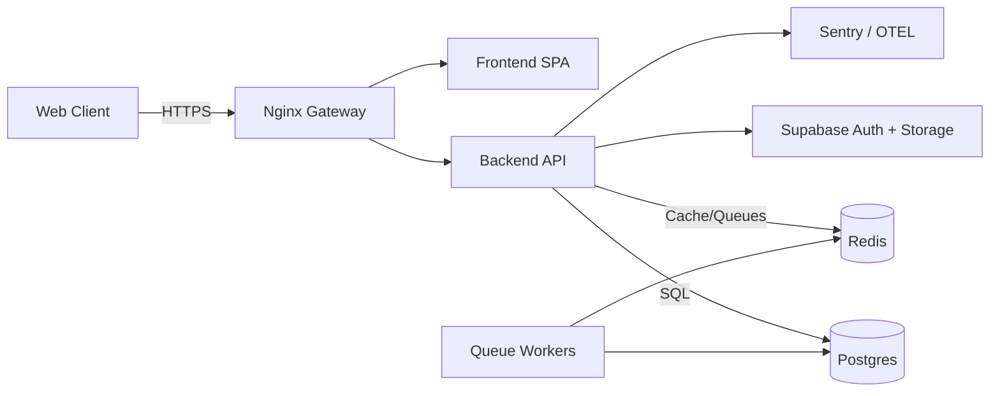

# Gharpayy Platform 

Version: March 2026

Gharpayy is a PG (Paying Guest) operating system with three user-facing layers: a public marketplace, an internal CRM, and an owner portal. It is built as a React SPA with a Node/Express API and a Supabase/Postgres data layer. The system is designed for 30+ CRM users, 100+ owners contributing inventory, and 10k+ daily visitors.

**Quick Links**
- Architecture summary: `docs/architecture.md`
- System diagram: `docs/SYSTEM_ARCHITECTURE.md`
- Security model: `docs/SECURITY_MODEL.md`
- Deployment: `docs/DEPLOYMENT_GUIDE.md`
- Production rollout checklist: `docs/PRODUCTION_ROLLOUT.md`
- Load testing: `docs/LOAD_TESTING.md`, `docs/load_test_report.md`

**Repository Structure**
- `frontend/` React SPA (public marketplace, CRM UI, owner portal)
- `backend/` Express API (auth, CRM ops, inventory, payments)
- `database/` SQL schema, RLS policies, triggers, production hardening
- `load-tests/` k6 load tests
- `docs/` system documentation and rollout guides
- `nginx/` gateway configuration
- `supabase/` Supabase project assets

**System Overview**
Layers and responsibilities:
- Public Marketplace: customer discovery, search, property detail, reservation
- Internal CRM: leads, pipeline, visits, bookings, analytics, follow-ups
- Owner Portal: inventory confirmation, booking visibility, effort metrics

**Tech Stack**
Frontend
- React 18 + TypeScript + Vite
- Tailwind CSS + shadcn/ui
- TanStack Query for server-state caching
- React Router for navigation
- Leaflet + react-leaflet for map discovery
- Recharts for analytics
- dnd-kit for pipeline Kanban
- Framer Motion for UI transitions

Backend
- Node.js + Express + TypeScript
- Supabase Auth + Postgres
- Redis + queues for background jobs
- Helmet CSP, rate limiting, idempotency

Database
- PostgreSQL (Supabase compatible)
- Row Level Security (RLS)
- Triggers for audit and status updates

Observability
- Sentry on frontend and backend
- JSON structured logs
- `/api/metrics` endpoint

---

**Frontend Application**
Entry and routing:
- `frontend/src/App.tsx`
- Public routes render under `/` and `/explore`
- Auth-gated routes for CRM and owner portal using role checks

Public Marketplace routes
- `/` landing page
- `/explore` search + map
- `/property/:id` property detail + pre-book
- `/capture` lead capture

CRM routes (protected)
- `/crm/dashboard`
- `/crm/leads`
- `/crm/pipeline`
- `/crm/visits`
- `/crm/conversations`
- `/crm/bookings`
- `/crm/analytics`
- `/crm/historical`
- `/crm/owners`
- `/crm/inventory`
- `/crm/availability`
- `/crm/effort`
- `/crm/matching`
- `/crm/zones`
- `/crm/notifications`
- `/crm/follow-ups`
- `/crm/settings`

Owner Portal routes (protected)
- `/owner-portal`
- `/owner/*`

Key frontend modules
- Marketplace UI: `frontend/src/pages/marketplace/*`
- CRM shell and modules: `frontend/src/pages/crm/*`
- Owner portal: `frontend/src/pages/owner/*`
- API client: `frontend/src/services/api.ts`
- Operations hooks: `frontend/src/hooks/useOperations.ts`

---

**Backend API**
Main entry:
- `backend/src/server.ts`
- `backend/src/routes/index.ts`

Public endpoints (no auth)
- `GET /api/public/properties`
- `GET /api/public/properties/:id`
- `GET /api/public/stats`
- `POST /api/public/capture`
- `POST /api/public/visit-request`
- `POST /api/public/chat`
- `POST /api/public/reservations`
- `POST /api/public/assistant`

CRM and owner endpoints (auth + RBAC)
- `GET /api/visits`
- `POST /api/visits`
- `PATCH /api/visits/:id/outcome`
- `GET /api/bookings`
- `GET /api/properties`
- `POST /api/properties`
- `PATCH /api/properties/:id/photos`
- `POST /api/rooms`
- `POST /api/rooms/:id/beds`
- `POST /api/room-status`
- `GET /api/inventory`
- `GET /api/owners`
- `POST /api/owners`
- `GET /api/effort`
- `GET /api/zones`
- `POST /api/zones`
- `PATCH /api/zones/:id`
- `GET /api/follow-ups`
- `POST /api/follow-ups`
- `PATCH /api/follow-ups/:id`
- `GET /api/notifications`
- `PATCH /api/notifications/:id/read`
- `POST /api/automation/run`
- `GET /api/owner-alerts`

Payments endpoints
- `POST /api/payments/webhook`
- `POST /api/payments/public-intent`
- `POST /api/payments/confirm`
- `POST /api/payments/intent` (auth)
- `POST /api/payments/refund` (auth + role)

Auth and settings
- `POST /api/auth/login`
- `POST /api/auth/reset-password`
- `GET /api/auth/me`
- `GET /api/settings/profile`
- `PATCH /api/settings/profile`

---

**Data Model Summary**
Core entities
- Users and roles: `profiles`, `agents`, `user_roles`
- Leads and activity: `leads`, `activity_log`, `follow_up_reminders`, `notifications`
- Marketplace inventory: `properties`, `rooms`, `beds`
- Scheduling: `visits`
- Booking lifecycle: `reservations`, `soft_locks`, `bookings`, `payment_transactions`
- Ownership: `owners`, `room_status_log`
- Routing: `zones`, `team_queues`

Schema and policies
- Schema: `database/schema.sql`
- RLS policies: `database/rls_policies.sql`
- Triggers: `database/triggers.sql`
- Production hardening: `database/production_hardening.sql`

---

**Data Flow and System Behavior**

1) Public Discovery and Reservation
- Visitor searches properties and views a listing
- Bed selection creates a soft lock and a reservation
- Payment intent is created and confirmed
- Booking is finalized, and bed status is updated

Flow
- UI: `frontend/src/pages/marketplace/*`
- API: `POST /api/public/reservations` then `POST /api/payments/public-intent`
- DB: `soft_locks` and `reservations`, then `bookings`

2) Lead Capture and CRM Pipeline
- Public lead capture creates a lead record
- Lead is routed to a zone and assigned to an agent
- Agents update status, add visits, and move through pipeline
- Visit outcome updates lead and booking data

Flow
- UI: `frontend/src/pages/marketplace/Capture.tsx`, `frontend/src/pages/crm/*`
- API: `POST /api/public/capture`, `GET/POST /api/visits`
- DB: `leads`, `visits`, `activity_log`, `bookings`

3) Owner Inventory Lifecycle
- Owner creates or updates properties and rooms
- Beds are added and marked with statuses
- Owners confirm room status via the portal

Flow
- UI: `frontend/src/pages/owner/*`
- API: `POST /api/properties`, `POST /api/rooms`, `POST /api/rooms/:id/beds`, `POST /api/room-status`
- DB: `properties`, `rooms`, `beds`, `room_status_log`

4) Automation and Notifications
- Scheduled jobs handle stale locks, reminders, and scoring
- Notifications surface in CRM

Flow
- Jobs: `backend/src/jobs/*`, `backend/src/queue/*`
- DB: `follow_up_reminders`, `notifications`

---

**Security and Access Control**
RBAC roles
- `admin`, `manager`, `agent`, `owner`

Enforcement points
- API middleware: `backend/src/middleware/auth.ts`, `backend/src/middleware/requireRole.ts`
- RLS policies: `database/rls_policies.sql`
- Hardened RLS: `database/production_hardening.sql`

Public endpoints are rate-limited and CAPTCHA-protected.

---

**Performance and Scale**
- Pagination and indexed queries in production hardening SQL
- Public caching and cursor pagination in backend services
- Load testing via k6 with reporting template

Files
- `docs/LOAD_TESTING.md`
- `load-tests/k6-public-traffic.js`
- `docs/load_test_report.md`

---

**Observability**
- Frontend error boundary in `frontend/src/App.tsx`
- Backend error middleware in `backend/src/middleware/errorHandler.ts`
- Sentry integration: `backend/src/observability/sentry.ts`, `docs/observability.md`
- Runtime metrics: `GET /api/metrics`

---

**Development and Deployment**
Dev
- Frontend: `frontend/`
- Backend: `backend/`

Production checklist
- `docs/PRODUCTION_ROLLOUT.md`

Deployment
- `docker-compose.yml`
- `docs/DEPLOYMENT_GUIDE.md`

---

**How the Pieces Connect**
Mermaid overview

---

**Assignment Coverage**
This codebase and documentation explicitly cover:
- CRM usability for 30+ internal team members
- Owner inventory workflows for 100+ owners
- Public site scale for 10k+ daily visitors

Evidence
- `docs/ASSIGNMENT_SCORECARD.md`
- `docs/NEXT_VERSION_IMPLEMENTATION.md`

---

**Useful Entry Points**
- Backend server: `backend/src/server.ts`
- API routes: `backend/src/routes/index.ts`
- Operations controller: `backend/src/controllers/operationsController.ts`
- Operations service: `backend/src/services/operationsService.ts`
- CRM UI: `frontend/src/pages/crm/index.tsx`
- Marketplace UI: `frontend/src/pages/marketplace/index.tsx`
- Owner portal: `frontend/src/pages/owner/OwnerPortal.tsx`

---

**Notes**
- Payments support Razorpay with webhooks and confirmation flows.
- Supabase Auth and JWT enforcement are required for production.
- RLS policies must be applied to ensure secure multi-tenant access.
