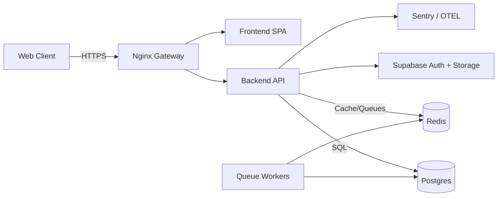

# System Architecture

## Overview
Gharpayy is a full-stack PG marketplace + CRM platform with a React frontend, Node/Express backend, and Supabase/Postgres data layer.

## High-Level Diagram

## Layers
- Public Marketplace: search, listing, property details, lead capture.
- Internal CRM: leads, pipeline, visits, bookings, analytics.
- Owner Portal: inventory confirmation, booking visibility, effort metrics.

